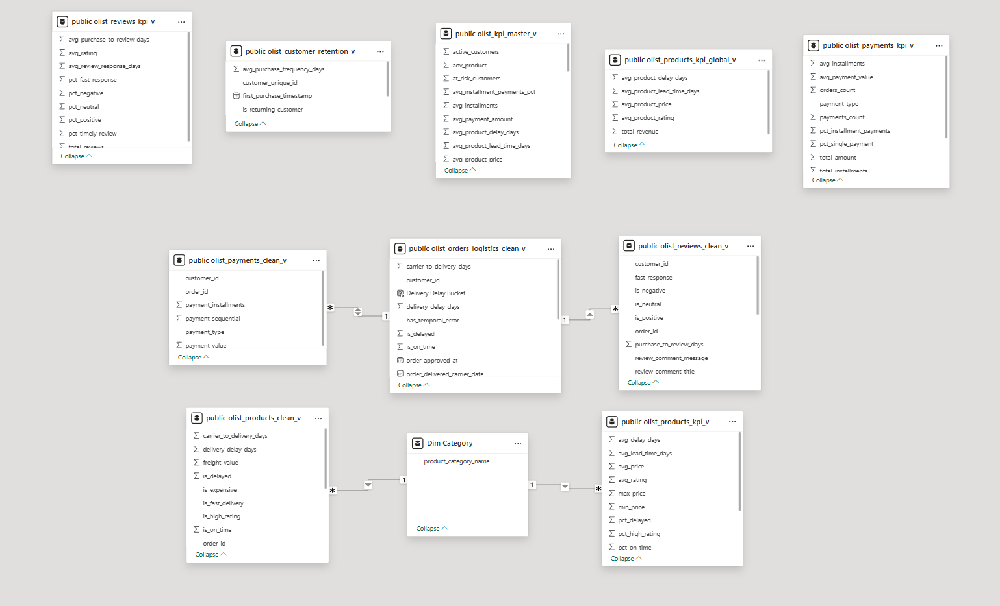
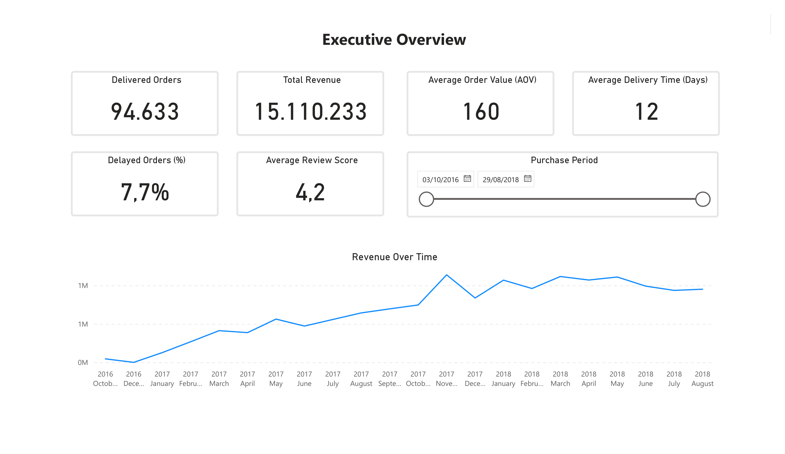
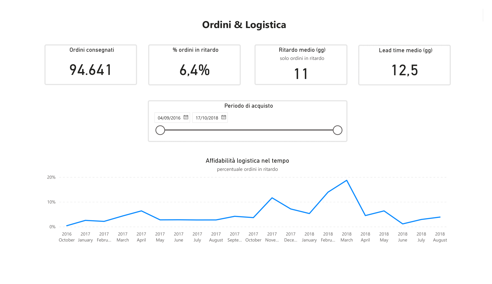

# Olist - E-Commerce Analysis (SQL + Power BI)

Data Analysis Project based on the public **Olist Brazilian E-Commerce** dataset, available on Kaggle: 
https://www.kaggle.com/datasets/olistbr/brazilian-ecommerce

The **Olist** database contains around **100,000 real orders**  from various marketplaces in Brazil during the period **2016-2018**. From the given data, it is possible to study the orders in several ways: order status and delivery speed, prices paid, method of payment, cost of shipping, geolocation of the clients, etc.
The objective of the project is to build a structured analytical pipeline with **PostgreSQL** and a dashboard with **Power BI** that is clear and easily understandable in real business scenarios.


## Objectives
- Model data exclusively using **SQL**: data cleaning, aggregation, and validation
- Define clear KPIs that are reusable over time
- Create distinct separation between **data logic (SQL)** and **presentation (Power BI)** to reduce errors and ambiguity
- Build a dashboard that can be used for business decision-making and monitor & measure performance


## Technologies
- **PostgreSQL 17**
- **Power BI**
- Windows 11


## Project Structure
```
Olist_Project/
├── data_kaggle/   # Original Olist CSV files (used to load the database, not included in the repository)
├── sql/           # Complete SQL pipeline: transformations, analysis, KPIs, and quality checks
├── powerbi/	   # Power BI project folder (report file available via external link)
├── docs/
│   ├── Olist_Ecommerce_Analysis.pdf    # PDF export of the report
│   ├── powerbi_model.png               # Power BI data model screenshot (Model View)
│   ├── dashboard_executive.png         # Executive Overview page screenshot
│   └── dashboard_ordini_logistica.png  # Orders & Logistics page screenshot
├── README.md      # Main documentation
└── README_IT.md   # Italian documentation
```


## SQL Architecture
Structured and ordered pipeline:
- **Schema and base layer** → `00_schema.sql`, `00_grezzi_calcoli.sql`
- **Thematic analyses** → customers, orders, products, reviews, and sellers
- **Executive KPIs** → `06_kpi_master.sql`
- **Data quality checks** → `07_quality_checks.sql`

All KPIs are **calculated and defined in SQL**.


## Data Model (Power BI)


- **Central fact table**: orders and logistics
- **Satellite tables**: customers, payments, and reviews
- **KPI views**: pre-aggregated in SQL and **intentionally disconnected** from the relational model

Design choice adopted to avoid:
- filter ambiguity
- duplicated logic
- KPI recalculation in DAX


## Power BI Dashboard
The report includes:
- Executive KPIs
- Orders and logistics performance
- Customer analysis and retention
- Product and category analysis
- Review quality
- Payment structure and methods

### Executive Overview


### Orders & Logistics


The Power BI report (.pbix) can be downloaded here: [Download Power BI report (.pbix)](https://drive.google.com/file/d/1YlEaOZDN1PlhQirBrGQY6uF79nOnb64R/view?usp=drive_link)

A static PDF version of the dashboard is available in the `docs/` folder.


## Reproducibility
1. Create a new PostgreSQL 17 database  
2. Import the Olist dataset CSV files into the `data_kaggle/` directory 
3. Run the SQL scripts in numerical order (00 → 07)  
4. Connect Power BI to the PostgreSQL database  
5. Download the .pbix report from the link above and open it in Power BI Desktop.  


## Notes
- The dataset is not included in the repository
- Project designed for **professional portfolio**
- Italian version available in `README_IT.md`

